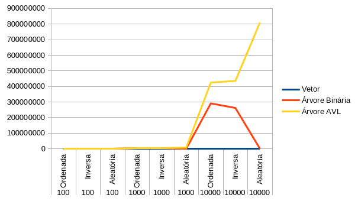
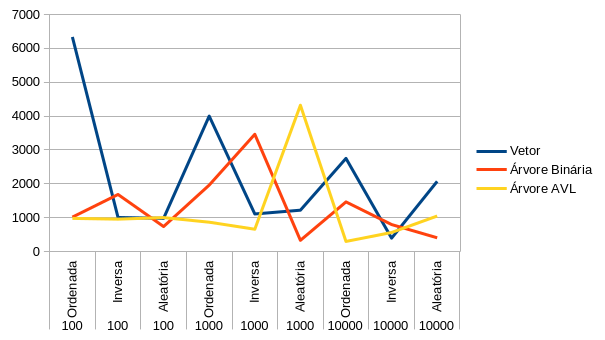
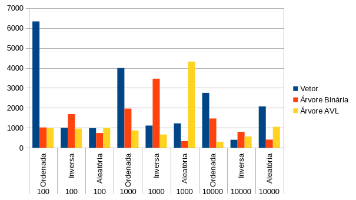

    
### Análise de Desempenho de Estruturas de Dados em Java
#### **Introdução**

Este trabalho tem como objetivo comparar o desempenho de diferentes estruturas de dados **Vetores, Árvores Binárias de Busca (ABB) e Árvores AVL**, em operações de **inserção e busca**, utilizando conjuntos de dados de tamanhos variados e diferentes ordens de inserção **(ordenada, inversa e aleatória)**.

Todos os algoritmos e estruturas foram implementados do **zero, sem uso de bibliotecas externas**, priorizando **códigos simples e/ou recursivos**, para reforçar o aprendizado sobre a complexidade e funcionamento interno dessas estruturas.

#### **Estrutura das pastas**

````
ANALISE-DESEMPENHO-JAVA/
│
├── src/
│ ├── vetor/
│ │ ├── Vetor.java → Implementação de vetor com inserção e busca
│ │ ├── OrdenacaoSimples.java → BubbleSort
│ │ └── OrdenacaoAvancada.java → QuickSort
│ │
│ ├── arvore/
│ │ ├── No.java → Classe representando um nó
│ │ ├── ArvoreABB.java → Árvore Binária de Busca (ABB)
│ │ └── ArvoreAVL.java → Árvore AVL auto-balanceada
│ │
│ ├── utils/
│ │ ├── GeradorDados.java → Gera conjuntos de dados
│ │ └── Cronometro.java → Mede tempo de execução
│ │
│ ├── estruturas/
│ │ └── EstruturasDados → Interface comum para todas as estruturas testadas
│ │
│ └── TestesDesempenhoEstruturas.java → Classe principal
│
├── relatorio/ → Relatório final em PDF
│ └── Relatorio_Analise.pd         
|
└── Readme
````
<br>

#### **Objetivo do Projeto**

**O projeto foi desenvolvido para:**
* Comparar **tempos de inserção e busca** entre:
  * Vetor
  * Árvore ABB
  * Árvore AVL
* Observar como o **formato dos dados de entrada** afeta o desempenho.
* Demonstrar efeitos como:
   * Desbalanceamento da ABB com entradas ordenadas
   * Estabilidade do desempenho da AVL devido ao balanceamento
   * Diferença entre buscas em vetor ordenado e desordenado

**Cenários Testados**
* Os experimentos são realizados com vetores de:
    * **100**
    * **1.000**
    * **10.000 elementos**
* E em três tipos de entrada:
    * **✔ Ordenada**
    * **✔ Inversa**
    * **✔ Aleatória**

**Métricas Coletadas**

O programa mede:

⏱ **Tempo médio de inserção** por estrutura

⏱ **Tempo médio de busca** por estrutura

A classe `Cronometro` é responsável pela medição precisa em nanosegundos.   

#### **Como Clonar e Executar o Projeto**
**1. Clone o repositório**

Use o comando abaixo para baixar o projeto para sua máquina:

```
git clone https://github.com/HianMaths/Analise-Desempenho-Java.git
```

Entre na pasta do projeto:
```
cd ANALISE-DESEMPENHO-JAVA
```

**2. Verifique a versão do Java**

O projeto requer Java 17+. Confira sua versão:
```
java -version
```

Se retornar versão inferior, atualize antes de continuar.

**3. Compile o projeto**

Compile todos os arquivos da pasta src/ para a pasta out/:

**Linux/macOS**
```
javac -d out $(find src -name "*.java")
```
**Windows**
```
javac -d out src\**\*.java
```
**4. Execute o programa principal**
```
java -cp out TestesDesempenhoEstruturas
```
Os resultados dos testes serão exibidos diretamente no console.
<br>

#### **Funcionamento Geral**

O fluxo do programa é:

* `GeradorDados` cria os vetores de teste.
* Cada estrutura recebe N elementos enquanto o `Cronometro` mede o tempo.
* A busca é testada usando o mesmo conjunto de dados.
* Os resultados são exibidos de forma organizada no console.

**Exemplo (fictício):**
```
=== Tamanho: 1000 ===
--- Ordem: Aleatória ---

[Vetor]
Inserção: 14544 ns
Busca:    6500 ns

[ABB]
Inserção: 23999 ns
Busca:    7022 ns

[AVL]
Inserção: 35000 ns
Busca:    3000 ns
```
<br>

#### **Resultados (Visual)**
A seguir estão alguns dos gráficos gerados durante a análise de desempenho das estruturas.
Eles ilustram os tempos médios de inserção e busca para Vetor, ABB e AVL em diferentes cenários e tamanhos de entrada.

**Tempo de Inserção**
Mostra como cada estrutura se comporta ao inserir 100, 1000 e 10.000 elementos, considerando entradas ordenadas, inversas e aleatórias.

<p align="center">  </p>

**Tempo de Busca**
Comparação dos tempos médios de busca nas três estruturas, analisando variações conforme a ordem dos dados.

<p align="center">  </p>

**Comparação Geral – Inserção x Busca**
Visão consolidada mostrando o custo relativo de cada operação nas diferentes estruturas analisadas.

<p align="center">  </p>

#### **Conclusão**

Este projeto demonstrou, na prática, como diferentes estruturas de dados se comportam diante de operações fundamentais como inserção e busca, evidenciando a relação direta entre o formato dos dados de entrada, o balanceamento das árvores e a complexidade de cada estrutura.